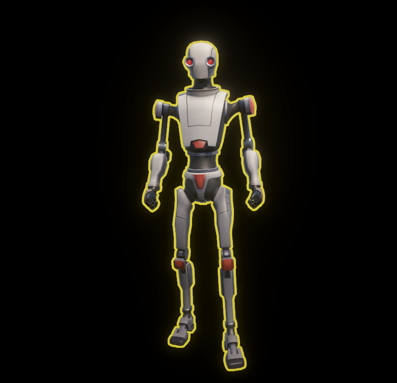
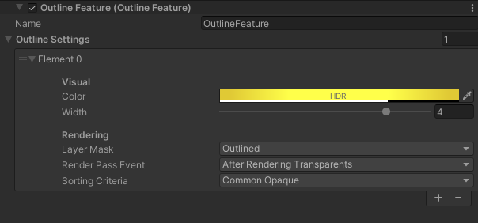

# Unity Outlines URP

## How it works

It works as a custom renderer feature. All objects in the target layer group would be outlined.

I used approach from [this gist](https://gist.github.com/mandarinx/5826e24f701141aaa0587d1a58cb3c6c), but changed some parts to make it work (original version did not work for me).

## Configuration

Please check URP renderer asset for outline settings.

